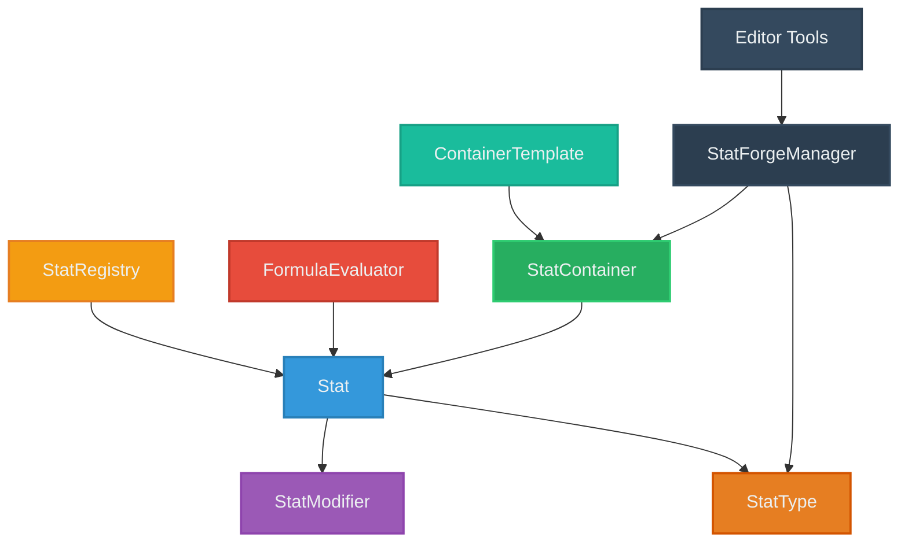

# 🔧 StatForge

<p align="center">
  
  
  
  
</p>

**StatForge** é um sistema modular e altamente otimizado para Unity que permite criar, gerenciar e manipular atributos (stats) de forma flexível e eficiente. Projetado para RPGs, jogos de estratégia, simuladores e qualquer projeto que precise de um sistema robusto de características com fórmulas dinâmicas e modificadores temporários.

## ✨ Principais Características

### 🎯 **Sistema Completo de Stats**
- **Modificadores Avançados**: 5 tipos de modificadores com prioridades e durações
- **Fórmulas Dinâmicas**: Calcule stats derivados usando fórmulas customizáveis
- **Dependências Automáticas**: Sistema inteligente de recálculo baseado em dependências
- **Cache Inteligente**: Recálculo apenas quando necessário

### 🚀 **Performance Otimizada**
- **Algoritmos Eficientes**: Busca O(1) por nome e abreviação
- **Pool de Modificadores**: Gerenciamento eficiente de memória
- **Detecção de Dependências Circulares**: Prevenção automática de loops infinitos
- **Lazy Evaluation**: Fórmulas calculadas apenas quando necessário

### 🎛️ **Editor Visual Completo**
- **Interface Intuitiva**: Crie e gerencie stats através do StatForge Manager
- **Templates Reutilizáveis**: Salve e reutilize configurações de containers
- **Categorização Automática**: Organização por Primary/Derived/External
- **Preview em Tempo Real**: Veja mudanças instantaneamente

### 📦 **Sistema Modular**
- **Containers Flexíveis**: Organize stats em grupos lógicos
- **StatRegistry**: Sistema automático de registro e dependências
- **Serialização Completa**: Compatível com Unity Serialization
- **Eventos Robustos**: Notificações detalhadas de mudanças

## 📥 Instalação

### Via Package Manager (Recomendado)

1. Abra o Package Manager (`Window > Package Manager`)
2. Clique no botão **+** no canto superior esquerdo
3. Selecione **"Add package from git URL..."**
4. Digite a URL: `https://github.com/Natteens/statforge.git`
5. Clique em **Add**

### Via manifest.json

Adicione ao arquivo `Packages/manifest.json` do seu projeto:

```json
{
  "dependencies": {
    "com.natteens.statforge": "https://github.com/Natteens/statforge.git"
  }
}
```

## 🏗️ Arquitetura do Sistema

### Diagrama de Componentes



### Componentes Principais

#### 🎯 **Stat** - Núcleo do Sistema
A classe central que representa um atributo individual:

```csharp
public class Stat
{
    public StatType StatType { get; }           // Definição do tipo
    public float BaseValue { get; set; }        // Valor base
    public float Value { get; }                 // Valor final calculado
    public string Name { get; }                 // Nome para exibição
    public string ShortName { get; }            // Nome abreviado
    public string Id { get; }                   // ID único
    public IReadOnlyList<IStatModifier> Modifiers { get; } // Modificadores ativos
}
```

**Características:**
- **Cache Inteligente**: Recalcula apenas quando `needsRecalculation = true`
- **Eventos**: `OnValueChanged`, `OnModifierAdded`, `OnModifierRemoved`
- **Modificadores**: 5 tipos com prioridades e durações
- **Fórmulas**: Avaliação automática usando `FormulaEvaluator`
- **Dependências**: Sistema automático via `StatRegistry`

#### 📊 **StatType** - Definição de Atributos
ScriptableObject que define as características de um tipo de stat:

```csharp
[CreateAssetMenu(menuName = "StatForge/StatType")]
public class StatType : ScriptableObject
{
    public string DisplayName;          // Nome completo
    public string ShortName;           // Abreviação (ex: "STR")
    public StatCategory Category;      // Primary/Derived/External
    public float DefaultValue;         // Valor padrão
    public float MinValue;            // Valor mínimo
    public float MaxValue;            // Valor máximo
    public string Formula;            // Fórmula para stats derivados
    public bool HasFormula => !string.IsNullOrEmpty(Formula);
}
```

#### 📦 **StatContainer** - Gerenciador de Coleções
Container otimizado para gerenciar múltiplos stats:

```csharp
public class StatContainer
{
    public void AddStat(Stat stat);
    public Stat CreateStat(StatType statType, float baseValue = 0f);
    public Stat GetStat(string nameOrShort);
    public float GetStatValue(string nameOrShort);
    public void Initialize();                    // Constrói dependências
    public void RecalculateAllStats();          // Força recálculo
    public void NotifyStatChanged(Stat stat);   // Notifica dependentes
}
```

**Funcionalidades:**
- **Busca Otimizada**: Dicionários `statsByName` e `statsByShort`
- **Dependências**: Construção automática do grafo via `BuildDependencies()`
- **Eventos**: `OnStatAdded`, `OnStatRemoved`, `OnStatValueChanged`
- **Detecção Circular**: Prevenção via `initializingStats`

#### ⚡ **Sistema de Modificadores**
Sistema flexível baseado na interface `IStatModifier`:

```csharp
public enum ModifierType
{
    Additive,        // +valor
    Subtractive,     // -valor  
    Multiplicative,  // *valor
    Percentage,      // +valor% do base
    Override         // =valor (ignora outros)
}

public enum ModifierDuration
{
    Permanent,       // Permanente
    Temporary,       // Por tempo (auto-remove)
    Conditional      // Por condição
}

public enum ModifierPriority
{
    VeryLow, Low, Normal, High, VeryHigh, Override
}
```

#### 🧮 **FormulaEvaluator** - Motor de Fórmulas
Avaliador otimizado de expressões matemáticas:

```csharp
public static class FormulaEvaluator
{
    // Avalia fórmulas como: "STR * 2 + CON + 10"
    public static float Evaluate(string formula, StatContainer container);
    public static float Evaluate(string formula, StatRegistry registry);
}
```

**Recursos:**
- **Operadores**: `+`, `-`, `*`, `/`, `()`, `^`
- **Referências**: Por nome completo ou abreviação
- **Regex Pattern**: `@"\b([A-Za-z][A-Za-z0-9_]*)\b"` para detectar stats
- **Cache**: Otimização automática de expressões

#### 🗂️ **StatRegistry** - Sistema de Registro
Registro automático de stats usando reflexão:

```csharp
public class StatRegistry
{
    public StatRegistry(object owner);           // Constrói via reflexão
    public Stat GetStat(string nameOrShort);
    public float GetStatValue(string nameOrShort);
    public void NotifyStatChanged(Stat changedStat);
    public void RefreshAll();
}
```

## 🚀 Guia de Uso Rápido

### 1. Criando StatTypes

```csharp
// Via Editor: Assets > Create > StatForge > StatType
// Ou programaticamente:
var strengthType = ScriptableObject.CreateInstance<StatType>();
strengthType.DisplayName = "Strength";
strengthType.ShortName = "STR";
strengthType.Category = StatCategory.Primary;
strengthType.DefaultValue = 10f;
strengthType.MinValue = 1f;
strengthType.MaxValue = 50f;
```

### 2. Criando Stats Básicos

```csharp
using StatForge;

public class Character : MonoBehaviour
{
    [SerializeField] private StatType strengthType;
    [SerializeField] private StatType constitutionType;
    
    private Stat strength;
    private Stat constitution;
    
    void Start()
    {
        // Criando stats individuais
        strength = new Stat(strengthType, 15f);
        constitution = new Stat(constitutionType, 12f);
        
        // Eventos
        strength.OnValueChanged += (stat, oldValue, newValue) => {
            Debug.Log($"[StatForge] {stat.Name}: {oldValue} → {newValue}");
        };
    }
}
```

### 3. Usando StatContainer

```csharp
public class CharacterStats : MonoBehaviour
{
    [SerializeField] private StatType[] statTypes;
    
    private StatContainer statsContainer;
    
    void Start()
    {
        statsContainer = new StatContainer("PlayerStats");
        
        // Adicionando stats
        foreach (var statType in statTypes)
        {
            statsContainer.CreateStat(statType, statType.DefaultValue);
        }
        
        statsContainer.Initialize(); // IMPORTANTE!
        
        // Usando
        var strength = statsContainer.GetStat("STR");
        var strengthValue = statsContainer.GetStatValue("Strength");
    }
}
```

### 4. Stats Derivados com Fórmulas

```csharp
// Criar um StatType para HP máximo com fórmula
var maxHpType = ScriptableObject.CreateInstance<StatType>();
maxHpType.DisplayName = "Max HP";
maxHpType.ShortName = "MHP";
maxHpType.Category = StatCategory.Derived;
maxHpType.Formula = "CON * 2 + STR * 0.5 + 50"; // Fórmula dinâmica

// Adicionar ao container
var maxHp = statsContainer.CreateStat(maxHpType);

// Agora maxHp.Value será calculado automaticamente baseado em CON e STR!
```

### 5. Sistema de Modificadores

```csharp
var strength = statsContainer.GetStat("STR");

// Modificadores básicos
var equipmentBonus = strength.AddBonus(5f, "Equipment");
var skillMultiplier = strength.AddMultiplier(1.2f, "Skill");
var temporaryBuff = strength.AddTemporary(10f, 30f, "Potion"); // +10 por 30s

// Modificadores avançados
var modifier = strength.AddModifier(
    value: 15f,
    type: ModifierType.Additive,
    duration: ModifierDuration.Temporary,
    time: 60f,
    priority: ModifierPriority.High,
    source: "Spell",
    tag: "magic_buff"
);

// Remoção
strength.RemoveModifier(modifier);
strength.RemoveModifiersBySource("Equipment");
strength.RemoveModifiersByTag("magic_buff");
strength.ClearModifiers();
```

### 6. Editor Tools - StatForge Manager

Acesse via `Window > StatForge > Manager` para:

- **📊 Gerenciar StatTypes**: Criar, editar e organizar tipos de stats
- **📦 Templates**: Criar templates reutilizáveis de containers
- **🔍 Preview**: Visualizar fórmulas e dependências em tempo real
- **⚙️ Configurações**: Ajustar comportamentos do sistema

## 🎮 Exemplos Práticos

### RPG Character System

```csharp
public class RPGCharacter : MonoBehaviour
{
    [Header("Stat Types")]
    [SerializeField] private StatType[] primaryStats;    // STR, DEX, CON, INT, WIS, CHA
    [SerializeField] private StatType[] derivedStats;    // HP, MP, AC, Initiative
    
    private StatContainer characterStats;
    
    void Start()
    {
        characterStats = new StatContainer("Character");
        
        // Stats primários
        foreach (var statType in primaryStats)
        {
            characterStats.CreateStat(statType, 10f); // Base 10
        }
        
        // Stats derivados (com fórmulas automáticas)
        foreach (var statType in derivedStats)
        {
            characterStats.CreateStat(statType);
        }
        
        characterStats.Initialize();
        
        // Exemplo de fórmulas no StatType:
        // HP: "CON * 2 + 10"
        // MP: "INT * 1.5 + WIS * 0.5"
        // AC: "DEX + 10"
    }
    
    public void LevelUp()
    {
        // Aumentar stats aleatoriamente
        var availableStats = characterStats.AllStats
            .Where(s => s.StatType.Category == StatCategory.Primary);
            
        foreach (var stat in availableStats)
        {
            if (Random.value > 0.5f)
            {
                stat.BaseValue += 1f;
            }
        }
    }
    
    public void EquipItem(Item item)
    {
        foreach (var bonus in item.StatBonuses)
        {
            var stat = characterStats.GetStat(bonus.StatName);
            stat?.AddBonus(bonus.Value, $"Equipment_{item.name}");
        }
    }
}
```

### Equipment System

```csharp
[CreateAssetMenu(menuName = "Game/Equipment")]
public class Equipment : ScriptableObject
{
    [System.Serializable]
    public class StatBonus
    {
        public string statName;
        public float value;
        public ModifierType type = ModifierType.Additive;
    }
    
    public StatBonus[] statBonuses;
    
    public void ApplyTo(StatContainer statsContainer)
    {
        foreach (var bonus in statBonuses)
        {
            var stat = statsContainer.GetStat(bonus.statName);
            if (stat != null)
            {
                stat.AddModifier(bonus.value, bonus.type, source: name);
            }
        }
    }
    
    public void RemoveFrom(StatContainer statsContainer)
    {
        foreach (var bonus in statBonuses)
        {
            var stat = statsContainer.GetStat(bonus.statName);
            stat?.RemoveModifiersBySource(name);
        }
    }
}
```

### Buff/Debuff System

```csharp
public class StatusEffect : MonoBehaviour
{
    [System.Serializable]
    public class StatEffect
    {
        public string statName;
        public float value;
        public ModifierType type;
    }
    
    [SerializeField] private StatEffect[] effects;
    [SerializeField] private float duration = 10f;
    
    private StatContainer targetStats;
    private List<IStatModifier> appliedModifiers = new();
    
    public void Apply(StatContainer stats)
    {
        targetStats = stats;
        
        foreach (var effect in effects)
        {
            var stat = stats.GetStat(effect.statName);
            if (stat != null)
            {
                var modifier = stat.AddModifier(
                    effect.value, 
                    effect.type, 
                    ModifierDuration.Temporary, 
                    duration,
                    source: name
                );
                appliedModifiers.Add(modifier);
            }
        }
        
        // Auto-remoção após duração
        StartCoroutine(RemoveAfterDuration());
    }
    
    private IEnumerator RemoveAfterDuration()
    {
        yield return new WaitForSeconds(duration);
        Remove();
    }
    
    public void Remove()
    {
        if (targetStats != null)
        {
            foreach (var modifier in appliedModifiers)
            {
                // Modificadores temporários se removem automaticamente
                // mas podemos forçar a remoção se necessário
            }
        }
        
        Destroy(gameObject);
    }
}
```

## 📚 API Reference

### Stat Class

```csharp
// Propriedades
public StatType StatType { get; }
public float BaseValue { get; set; }
public float Value { get; }
public string Name { get; }
public string ShortName { get; }
public string Id { get; }
public IReadOnlyList<IStatModifier> Modifiers { get; }

// Eventos
public event Action<Stat, float, float> OnValueChanged;
public event Action<Stat, IStatModifier> OnModifierAdded;
public event Action<Stat, IStatModifier> OnModifierRemoved;

// Modificadores - Métodos Básicos
public IStatModifier AddBonus(float value, string source = "");
public IStatModifier AddDebuff(float value, string source = "");
public IStatModifier AddMultiplier(float multiplier, string source = "");
public IStatModifier AddPercentage(float percentage, string source = "");
public IStatModifier AddTemporary(float value, float duration, string source = "");
public IStatModifier SetOverride(float value, string source = "");

// Modificadores - Métodos Avançados
public IStatModifier AddModifier(float value, ModifierType type = ModifierType.Additive, 
                                ModifierDuration duration = ModifierDuration.Permanent, 
                                float time = 0f, ModifierPriority priority = ModifierPriority.Normal,
                                string source = "", object tag = null);

// Remoção de Modificadores
public bool RemoveModifier(IStatModifier modifier);
public bool RemoveModifier(string id);
public void RemoveModifiersBySource(string source);
public void RemoveModifiersByTag(object tag);
public void ClearModifiers();

// Utilitários
public void ForceRecalculate();
public static implicit operator float(Stat stat);
```

### StatContainer Class

```csharp
// Propriedades
public string Name { get; }
public int Count { get; }
public IEnumerable<Stat> AllStats { get; }

// Eventos
public event Action<Stat> OnStatAdded;
public event Action<Stat> OnStatRemoved;
public event Action<Stat, float, float> OnStatValueChanged;

// Gerenciamento de Stats
public void AddStat(Stat stat);
public Stat CreateStat(StatType statType, float baseValue = 0f);
public bool RemoveStat(Stat stat);
public bool RemoveStat(string nameOrShort);
public void ClearStats();

// Busca e Acesso
public Stat GetStat(string nameOrShort);
public float GetStatValue(string nameOrShort);

// Sistema
public void Initialize();
public void RecalculateAllStats();
public void NotifyStatChanged(Stat stat);
```

### FormulaEvaluator Class

```csharp
public static class FormulaEvaluator
{
    // Avaliação de fórmulas
    public static float Evaluate(string formula, StatContainer container);
    public static float Evaluate(string formula, StatRegistry registry);
    
    // Operadores suportados: +, -, *, /, ^, ()
    // Referências: Por nome completo ou abreviação
    // Exemplo: "STR * 2 + CON + 10"
}
```

## ⚡ Performance e Otimizações

### Características de Performance

- **Cache Inteligente**: Propriedade `needsRecalculation` controla recálculos
- **Pooling**: Reutilização de objetos para modificadores temporários
- **Algoritmos O(1)**: Dicionários para busca por nome/abreviação
- **Lazy Evaluation**: Fórmulas calculadas apenas quando `Value` é acessado
- **Batch Operations**: `RecalculateAllStats()` para operações em lote

### Benchmarks (Baseados nos Testes)

```
Operação                    | Tempo (ms) | Descrição
---------------------------|------------|------------------------------------------
1000 Modificadores         | < 100      | Teste de performance realístico
Recálculo de Dependências  | < 50       | BuildDependencies() completo
Busca por Nome/Abreviação  | < 1        | GetStat() otimizado
Avaliação de Fórmulas     | < 10       | FormulaEvaluator.Evaluate()
```

### Dicas de Performance

1. **Use StatContainer**: Mais eficiente que `StatRegistry` individual
2. **Inicialize uma vez**: Chame `Initialize()` após adicionar todos os stats
3. **Cache referências**: Evite `GetStat()` repetitivo em loops
4. **Modificadores temporários**: Use `ModifierDuration.Temporary` para auto-limpeza
5. **Fórmulas simples**: Evite expressões muito complexas

## 🧪 Testes

O sistema inclui uma suíte completa de testes em `Tests/Runtime/StatForgeTests.cs`:

```bash
# Executar testes no Unity Test Runner
Window > General > Test Runner
```

### Categorias de Teste

- **Core**: `TestBasicStatCreation` - Funcionalidades básicas de Stat
- **Modifiers**: `TestModifierSystem`, `TestTemporaryModifiers` - Sistema de modificadores
- **Container**: `TestStatContainer` - StatContainer e dependências
- **Performance**: `TestPerformanceScenario`, `TestPerformanceRealistic` - Testes de stress
- **Clamp**: `TestClampingBehavior` - Validação de limites min/max

## 🐛 Troubleshooting

### Problemas Comuns

**1. Fórmulas não funcionam**
```csharp
// ❌ Errado - não inicializado
container.CreateStat(derivedStatType);
float value = container.GetStatValue("DerivedStat"); // Retorna 0

// ✅ Correto
container.CreateStat(derivedStatType);
container.Initialize(); // Importante!
float value = container.GetStatValue("DerivedStat"); // Funciona
```

**2. Dependências circulares**
```csharp
// ❌ Evitar dependências circulares
statA.Formula = "B + 10";  // A depende de B
statB.Formula = "A * 2";   // B depende de A (circular!)

// ✅ Usar hierarquia clara
primaryStat.Formula = "";           // Sem fórmula
derivedStat.Formula = "Primary * 2"; // Depende apenas de primary
```

**3. Performance baixa**
```csharp
// ❌ Evitar
for (int i = 0; i < 1000; i++)
{
    var stat = container.GetStat("STR"); // Busca repetitiva
    stat.AddBonus(1);
}

// ✅ Melhor
var stat = container.GetStat("STR"); // Cache a referência
for (int i = 0; i < 1000; i++)
{
    stat.AddBonus(1);
}
```

### Debug Tools

```csharp
// Log básico (built-in do sistema)
Debug.Log($"[StatForge] {stat.Name}: {stat.Value}");

// Inspecionar modificadores
foreach (var modifier in stat.Modifiers)
{
    Debug.Log($"Modifier: {modifier.Value} ({modifier.Type}) from {modifier.Source}");
}

// Validar container
Debug.Log($"Container '{container.Name}' tem {container.Count} stats");
foreach (var stat in container.AllStats)
{
    Debug.Log($"- {stat.Name}: {stat.Value}");
}
```


<p align="center">
  Feito por Natte (Natteens) 😎
</p>