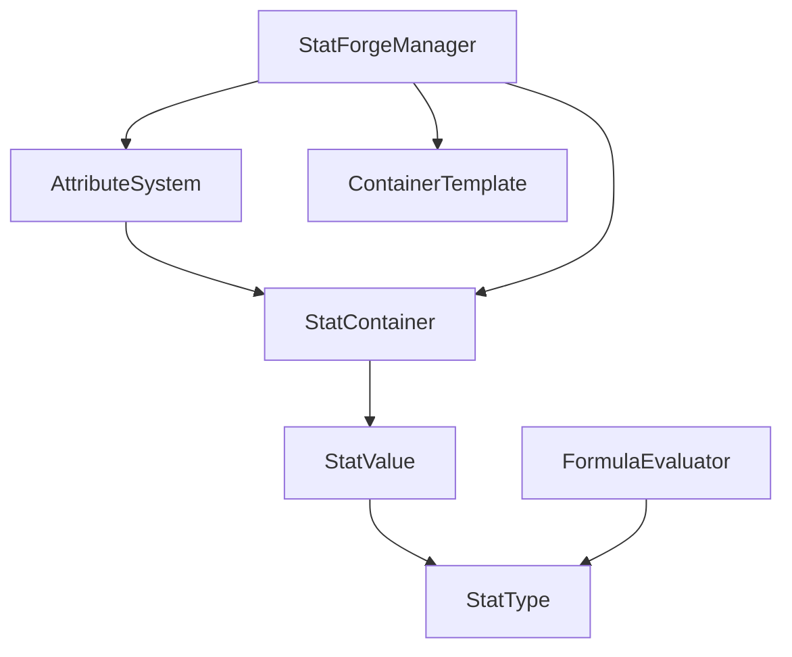

# 🔧 StatForge

<p align="center">
  
  
  
</p>

**StatForge** é um sistema modular e poderoso para Unity que permite criar, gerenciar e manipular atributos (stats) de forma flexível e eficiente. **Versão 1.0 apresenta uma API completamente refatorada e simplificada!**

## 🆕 Nova API Simplificada (v1.0)

### ✨ Uso Direto - Sem Inicialização!

```csharp
public class PlayerHealth : MonoBehaviour 
{
    [SerializeField] private Stat maxHealth;    // Drag & drop no inspector!
    [SerializeField] private Stat currentHealth;
    
    void Start() 
    {
        currentHealth.Value = maxHealth.Value; // ✨ Funciona imediatamente!
    }
    
    public void TakeDamage(float damage) 
    {
        currentHealth.Value -= damage; // 🎯 API simples e direta
    }
}
```

### 🚀 Principais Melhorias

- 🎯 **API Zero-Config**: Use stats diretamente sem inicialização
- 🎨 **Inspector Inteligente**: Detecção automática de campos Stat
- 🏷️ **Sistema de Abreviações**: STR, DEX, HP, MP, etc.
- ⚡ **Performance Otimizada**: Zero reflection em runtime  
- 🎛️ **Modificadores Avançados**: Sistema completo com duração e origem
- 📊 **Eventos Robustos**: Sistema global e por-stat
- 🔄 **Compatibilidade**: Sistema legado continua funcionando
- 🎨 **Editor Visual**: Interface moderna com cores e ícones

## ✨ Características Principais

### 🆕 Novo Sistema
- 📊 **StatDefinition**: Versão aprimorada com cores e ícones
- 🎯 **Classe Stat**: Referência simples para uso direto
- 🎨 **Editor Avançado**: Interface tabular moderna
- 🔄 **Migração Automática**: Ferramentas para atualizar projetos existentes
- ⚡ **Sistema de Eventos**: Global e por instância

### 📋 Sistema Legado (Ainda Suportado)
- 🎯 **Sistema de Categorias**: Primary, Derived e External stats
- 📊 **Fórmulas Dinâmicas**: Calcule stats derivados com abreviações
- 🔧 **Editor Visual**: Interface completa para criação e gerenciamento
- 📦 **Containers Modulares**: Organize stats por categoria
- 🎛️ **Sistema de Pontos**: Alocação e desalocação dinâmica

## 📥 Instalação

### Via Package Manager (Recomendado)

1. Abra o Package Manager (`Window > Package Manager`)
2. Clique no botão **+** no canto superior esquerdo
3. Selecione **"Add package from git URL..."**
4. Digite a URL: `https://github.com/Natteens/statforge.git`
5. Clique em **Add**

### Via manifest.json

Adicione ao arquivo `Packages/manifest.json` do seu projeto:

```json
{
  "dependencies": {
    "com.natteens.statforge": "https://github.com/Natteens/statforge.git"
  }
}
```

## 🏗️ Arquitetura do Sistema

### Componentes Principais



#### 📊 **StatType** - Definição de Atributos
Define as características base de um atributo:
- Nome de exibição e nome curto
- Categoria (Primary/Derived/External)
- Valores padrão, mínimo e máximo
- Fórmulas para stats derivados

#### 📦 **StatContainer** - Agrupamento de Stats
Organiza e gerencia coleções de stats:
- Auto-população baseada em categorias
- Sistema de merge para combinar containers
- Recálculo automático de dependências

#### 💎 **StatValue** - Valor Atual
Representa o valor atual de um stat:
- Valor base + pontos alocados + bônus
- Eventos de mudança de valor
- Suporte a modificadores

#### ⚙️ **AttributeSystem** - Gerenciador Principal
Componente Unity que controla todo o sistema:
- Alocação de pontos
- Modificadores temporários
- Interface unificada de acesso

## 🚀 Guia de Uso Rápido

### 🆕 Nova API Simplificada (Recomendada)

#### 1. Criando StatDefinitions
1. Abra o **StatForge Window**: `Tools > StatForge > StatForge Window`
2. Na aba **Definitions**, clique em **+** para criar uma nova StatDefinition
3. Configure as propriedades:

```csharp
Display Name: "Health Points"
Short Name: "Health" 
Abbreviation: "HP"
Category: Primary
Default Value: 100
Color: Red (para identificação visual)
```

#### 2. Usando Stats em Componentes

```csharp
using StatForge;

public class Character : MonoBehaviour
{
    [Header("Basic Stats")]
    [SerializeField] private Stat health;      // Configurado no inspector
    [SerializeField] private Stat mana;        // Drag & drop StatDefinition
    [SerializeField] private Stat strength;
    
    void Start()
    {
        // ✨ Nenhuma inicialização necessária!
        
        // Eventos simples
        health.OnValueChanged += OnHealthChanged;
        
        // Ou eventos avançados
        health.Events.OnValueChanged += (oldVal, newVal) => 
            Debug.Log($"Health: {oldVal} -> {newVal}");
        
        // Modificadores com duração
        strength.AddTemporaryBonus(10f, 30f); // +10 por 30 segundos
    }
    
    void OnHealthChanged(Stat stat)
    {
        Debug.Log($"Health is now: {stat.Value}");
        
        // Verificar porcentagem
        if (stat.GetPercentage() <= 0.2f) 
        {
            Debug.LogWarning("Low health!");
        }
    }
    
    [ContextMenu("Take Damage")]
    void TakeDamage()
    {
        health.Value -= 25f; // API direta!
    }
}
```

#### 3. Sistema de Modificadores Avançado

```csharp
// Buff temporário
var strengthBuff = new StatModifier(
    value: 15f,                               // +15 de força
    type: StatModifier.ModifierType.Flat,     // Valor fixo
    duration: 60f,                            // 60 segundos
    source: "Strength Potion"                 // Fonte para tracking
);
strength.AddModifier(strengthBuff);

// Buff percentual
var defenseBoost = new StatModifier(
    value: 25f,                               // +25%
    type: StatModifier.ModifierType.Percentage,
    duration: 120f,
    source: "Shield Spell"
);
defense.AddModifier(defenseBoost);

// Remover por fonte
defense.RemoveModifiersFromSource("Shield Spell");
```

#### 4. Extension Methods Para Produtividade

```csharp
// Métodos de conveniência
health.FillToMax();           // health.Value = health.StatType.MaxValue
health.EmptyToMin();          // health.Value = health.StatType.MinValue  
health.ResetToDefault();      // health.Value = health.StatType.DefaultValue

// Buscar stats por nome/abreviação
var hpStat = this.GetStat("HP");          // Por abreviação
var manaStat = this.GetStat("Mana");      // Por nome

// Filtrar por categoria  
var allStats = this.GetAllStats();
var primaryStats = allStats.FilterByCategory(StatCategory.Primary);
```

### 📋 Sistema Legado (Para Projetos Existentes)

Se você já usa o StatForge, seu código continua funcionando! O sistema legado com `AttributeSystem` e `StatContainer` está totalmente preservado.

#### Usando AttributeSystem (Legado)

```csharp
using StatForge;

public class Character : MonoBehaviour
{
    [SerializeField] private AttributeSystem attributeSystem;
    
    void Start()
    {
        // Sistema legado ainda funciona
        attributeSystem.SetAvailablePoints(20);
        
        float strength = attributeSystem.GetStatValue(strengthStat);
        attributeSystem.AddTemporaryBonus(strengthStat, 5f);
        
        if (attributeSystem.CanAllocatePoint(strengthStat))
        {
            attributeSystem.AllocatePoint(strengthStat);
        }
    }
}
```

## 📝 Sistema de Fórmulas

O StatForge suporta fórmulas matemáticas complexas para calcular stats derivados:

### Operadores Suportados
- `+` Adição
- `-` Subtração
- `*` Multiplicação
- `/` Divisão
- `()` Parênteses para agrupamento

### Referências a Stats
Use o **Short Name** dos stats nas fórmulas:

```csharp
// Exemplos de fórmulas
"STR + DEX"                    // Soma simples
"(STR + CON) * 2"             // Com parênteses
"STR * 5 + CON * 3"           // Multiplicação e soma
"25% STR + 75% DEX"           // Percentuais
```

### Exemplos Práticos

```csharp
// Health Points baseado em Constituição
Formula: "CON * 10 + 50"

// Dano físico baseado em Força e Destreza
Formula: "STR * 2 + DEX * 0.5"

// Velocidade de movimento
Formula: "(DEX + AGI) / 2 + 5"

// Mana baseada em Inteligência
Formula: "INT * 15 + WIS * 5"
```

## 🎮 Casos de Uso Comuns

### RPG Clássico

```csharp
// Stats primários
Strength (STR) - Primary
Dexterity (DEX) - Primary  
Constitution (CON) - Primary
Intelligence (INT) - Primary
Wisdom (WIS) - Primary
Charisma (CHA) - Primary

// Stats derivados
Health Points: "CON * 10 + 50"
Mana Points: "INT * 8 + WIS * 2"
Attack Damage: "STR * 2 + DEX * 0.5"
Armor Class: "DEX + 10"
```

### Sistema de Habilidades

```csharp
// Container para cada habilidade
Swordsmanship Container:
- Base Damage: STR-based
- Critical Chance: DEX-based
- Skill Level: Allocated points

Magic Container:
- Spell Power: INT-based
- Mana Cost Reduction: WIS-based
- Spell Level: Allocated points
```

### Sistema de Equipamentos

```csharp
// Cada item tem seu próprio container
Sword Container:
- Attack Damage: +15
- Critical Chance: +5%

Heavy Armor Container:
- Defense: +20
- Movement Speed: -10%
```

## 🛠️ API Reference

### AttributeSystem

```csharp
// Gerenciamento de pontos
void SetAvailablePoints(int points)
void AddAvailablePoints(int points)
int AvailablePoints { get; }

// Alocação de pontos
bool CanAllocatePoint(StatType statType)
bool AllocatePoint(StatType statType)
bool CanDeallocatePoint(StatType statType)
bool DeallocatePoint(StatType statType)
void ResetAllocatedPoints()

// Obter valores
float GetStatValue(StatType statType)
List<StatValue> GetPrimaryStats()
List<StatValue> GetDerivedStats()
List<StatValue> GetExternalStats()

// Modificadores temporários
void AddTemporaryBonus(StatType statType, float bonus)
void RemoveTemporaryBonus(StatType statType, float bonus)
void SetTemporaryBonus(StatType statType, float bonus)
void ClearTemporaryBonuses()
float GetTemporaryBonus(StatType statType)
```

### StatContainer

```csharp
// Gerenciamento de stats
void AddStat(StatType statType, float baseValue = 0f)
bool RemoveStat(StatType statType)
StatValue GetStat(StatType statType)
StatValue GetOrCreateStat(StatType statType)
bool HasStat(StatType statType)

// Valores
float GetStatValue(StatType statType)
void SetAllocatedPoints(StatType statType, float points)
void SetBonusValue(StatType statType, float bonus)
void SetBaseValue(StatType statType, float baseValue)

// Operações avançadas
static StatContainer Merge(params StatContainer[] containers)
void ForceRecalculate()
void Initialize()
```

## 🎨 Editor Features

### StatForge Manager
Interface visual completa acessível via `Tools > StatForge > Manager`:

- **Stat Types**: Criar e editar definições de stats
- **Containers**: Gerenciar coleções de stats
- **Templates**: Criar templates reutilizáveis
- **Tests**: Ambiente de teste interativo

### Inspector Customizado
O `AttributeSystem` possui um inspector customizado que mostra:

- Pontos disponíveis com controles de teste
- Lista de todos os stats com valores atuais
- Controles para alocar/desalocar pontos
- Campos para modificadores temporários

## 🔧 Configuração Avançada

### Auto-População
Configure containers para auto-popular com stats de determinadas categorias:

```csharp
container.SetAutoPopulateSettings(
    primary: true,    // Incluir stats primários
    derived: true,    // Incluir stats derivados  
    external: false   // Excluir stats externos
);
```

### Merge de Containers
Combine múltiplos containers em um só:

```csharp
var playerContainer = StatContainer.Merge(
    baseStatsContainer,
    classStatsContainer, 
    equipmentContainer
);
```

### Templates
Use templates para criar containers padronizados:

```csharp
// Criar template no editor
var warriorTemplate = CreateTemplate("Warrior", new[] {
    strengthStat, constitutionStat, armorStat, healthStat
});

// Usar template
var warriorContainer = CreateContainerFromTemplate(warriorTemplate);
```

## 🎯 Melhores Práticas

### Organização de Assets
```
Assets/
├── Stats/
│   ├── Primary/
│   │   ├── Strength.asset
│   │   ├── Dexterity.asset
│   │   └── Constitution.asset
│   ├── Derived/
│   │   ├── HealthPoints.asset
│   │   └── AttackDamage.asset
│   └── Containers/
│       ├── BaseCharacter.asset
│       ├── WarriorClass.asset
│       └── MageClass.asset
```

### Performance
- Use o cache de lookup dos containers
- Evite recálculos desnecessários
- Agrupe stats relacionados em containers separados

### Design de Fórmulas
- Mantenha fórmulas simples e legíveis
- Use nomes curtos descritivos para stats
- Teste fórmulas no ambiente de teste do editor

## 🐛 Resolução de Problemas

### Fórmulas Não Funcionam
- Verifique se os Short Names estão corretos
- Confirme que não há referências circulares
- Use o ambiente de teste para debugar

### Stats Não Aparecem
- Verifique as configurações de auto-população
- Confirme que o container foi inicializado
- Verifique se os stats estão na categoria correta

### Performance Baixa
- Evite muitas dependências entre stats
- Use containers separados para sistemas independentes
- Cache valores que não mudam frequentemente

---

<p align="center">
  Feito por Natte (Natteens) 😎
</p>