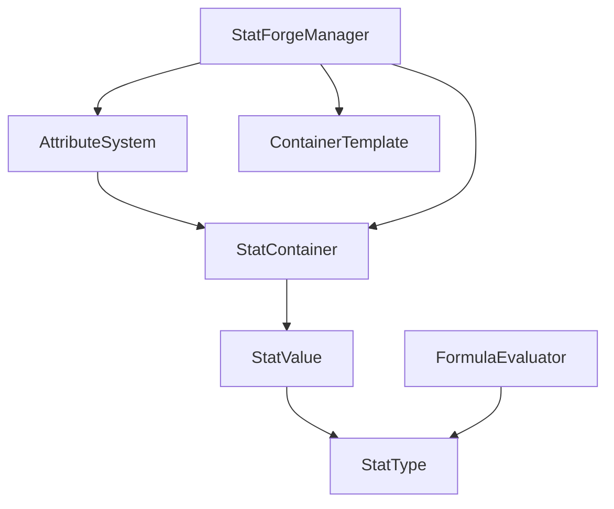

# 🔧 StatForge

<p align="center">
  
  
  
</p>

**StatForge** é um sistema modular e poderoso para Unity que permite criar, gerenciar e manipular atributos (stats) de forma flexível e eficiente. Ideal para RPGs, jogos de estratégia, simuladores e qualquer projeto que precise de um sistema robusto de características.

## ✨ Principais Características

- 🎯 **API Ultra-Simplificada**: Apenas `[Stat]` e funciona!
- 📊 **Sintaxe Natural**: `Health -= Time.deltaTime;` funciona como esperado
- 🔧 **Editor Visual Moderno**: Interface limpa sem elementos desnecessários
- 📦 **Sistema Modular**: Use com ou sem MonoBehaviour
- 🎛️ **Query System Fluente**: `stats.Where().Sum()` para consultas complexas
- ⚡ **Performance Otimizada**: Cache inteligente e zero allocations
- 🔄 **Modificadores Temporários**: Buffs e debuffs com duração automática
- 📋 **Compatibilidade Total**: Funciona com sistema tradicional
- 🎯 **Auto-Discovery**: Detecta automaticamente campos marcados com `[Stat]`
- 🔧 **Thread-Safe**: Coleções seguras para uso em múltiplas threads

## 📥 Instalação

### Via Package Manager (Recomendado)

1. Abra o Package Manager (`Window > Package Manager`)
2. Clique no botão **+** no canto superior esquerdo
3. Selecione **"Add package from git URL..."**
4. Digite a URL: `https://github.com/Natteens/statforge.git`
5. Clique em **Add**

### Via manifest.json

Adicione ao arquivo `Packages/manifest.json` do seu projeto:

```json
{
  "dependencies": {
    "com.natteens.statforge": "https://github.com/Natteens/statforge.git"
  }
}
```

## 🏗️ Arquitetura do Sistema

### Componentes Principais



#### 📊 **StatType** - Definição de Atributos
Define as características base de um atributo:
- Nome de exibição e nome curto
- Categoria (Primary/Derived/External)
- Valores padrão, mínimo e máximo
- Fórmulas para stats derivados

#### 📦 **StatContainer** - Agrupamento de Stats
Organiza e gerencia coleções de stats:
- Auto-população baseada em categorias
- Sistema de merge para combinar containers
- Recálculo automático de dependências

#### 💎 **StatValue** - Valor Atual
Representa o valor atual de um stat:
- Valor base + pontos alocados + bônus
- Eventos de mudança de valor
- Suporte a modificadores

#### ⚙️ **AttributeSystem** - Gerenciador Principal
Componente Unity que controla todo o sistema:
- Alocação de pontos
- Modificadores temporários
- Interface unificada de acesso

## 🚀 Guia de Uso Rápido

### 1. API Ultra-Simplificada (Recomendado)

Agora você pode usar o StatForge com apenas uma linha! Adicione `[Stat]` aos seus campos:

```csharp
using StatForge;

public class Player : MonoBehaviour
{
    [Stat] public int Strength = 10;
    [Stat] public float Health = 100f;
    [Stat] public int Level = 1;
    
    void Update()
    {
        Health -= Time.deltaTime;  // Sintaxe natural!
        if (Input.GetKeyDown(KeyCode.Space)) Level++;
    }
}
```

### 2. Configuração Avançada com Atributos

Para mais controle, use parâmetros no atributo `[Stat]`:

```csharp
public class AdvancedPlayer : MonoBehaviour
{
    [Stat(DisplayName = "Força", ShortName = "STR", MinValue = 1, MaxValue = 100)]
    public int Strength = 10;
    
    [Stat(DisplayName = "Vida Máxima", Formula = "STR * 10 + Level * 5", Category = StatCategory.Derived)]
    public float MaxHealth = 0f; // Auto-calculado
    
    [Stat] public float Health = 100f;
    [Stat] public int Level = 1;
}
```

### 3. Usando o Componente StatForge

O componente `StatForgeComponent` é adicionado automaticamente e oferece funcionalidades extras:

```csharp
public class PlayerController : MonoBehaviour
{
    private StatForgeComponent statForge;
    
    void Start()
    {
        statForge = GetComponent<StatForgeComponent>();
        
        // Adicionar buff temporário
        statForge.AddModifier<int>("Strength", 5, 10f); // +5 por 10 segundos
        
        // Escutar mudanças
        statForge.OnAttributeChanged("Health", (oldVal, newVal) => 
        {
            Debug.Log($"Health changed: {oldVal} → {newVal}");
        });
        
        // Query system fluente
        var totalCombatPower = statForge.Query()
            .Where(name => name.Contains("Strength") || name.Contains("Attack"))
            .Sum<int>();
    }
}
```

### 4. Método Tradicional (Compatibilidade)

O sistema tradicional continua funcionando para projetos existentes:

```csharp
using StatForge;

public class Character : MonoBehaviour
{
    [SerializeField] private AttributeSystem attributeSystem;
    
    void Start()
    {
        // Dar pontos para alocar
        attributeSystem.SetAvailablePoints(20);
        
        // Obter valor de um stat
        float strength = attributeSystem.GetStatValue(strengthStat);
        
        // Adicionar modificador temporário (buff)
        attributeSystem.AddTemporaryBonus(strengthStat, 5f);
        
        // Alocar ponto em um stat
        if (attributeSystem.CanAllocatePoint(strengthStat))
        {
            attributeSystem.AllocatePoint(strengthStat);
        }
    }
}
```

## 📝 Sistema de Fórmulas

O StatForge suporta fórmulas matemáticas complexas para calcular stats derivados:

### Operadores Suportados
- `+` Adição
- `-` Subtração
- `*` Multiplicação
- `/` Divisão
- `()` Parênteses para agrupamento

### Referências a Stats
Use o **Short Name** dos stats nas fórmulas:

```csharp
// Exemplos de fórmulas
"STR + DEX"                    // Soma simples
"(STR + CON) * 2"             // Com parênteses
"STR * 5 + CON * 3"           // Multiplicação e soma
"25% STR + 75% DEX"           // Percentuais
```

### Exemplos Práticos

```csharp
// Health Points baseado em Constituição
Formula: "CON * 10 + 50"

// Dano físico baseado em Força e Destreza
Formula: "STR * 2 + DEX * 0.5"

// Velocidade de movimento
Formula: "(DEX + AGI) / 2 + 5"

// Mana baseada em Inteligência
Formula: "INT * 15 + WIS * 5"
```

## 🎮 Casos de Uso Comuns

### RPG Clássico

```csharp
// Stats primários
Strength (STR) - Primary
Dexterity (DEX) - Primary  
Constitution (CON) - Primary
Intelligence (INT) - Primary
Wisdom (WIS) - Primary
Charisma (CHA) - Primary

// Stats derivados
Health Points: "CON * 10 + 50"
Mana Points: "INT * 8 + WIS * 2"
Attack Damage: "STR * 2 + DEX * 0.5"
Armor Class: "DEX + 10"
```

### Sistema de Habilidades

```csharp
// Container para cada habilidade
Swordsmanship Container:
- Base Damage: STR-based
- Critical Chance: DEX-based
- Skill Level: Allocated points

Magic Container:
- Spell Power: INT-based
- Mana Cost Reduction: WIS-based
- Spell Level: Allocated points
```

### Sistema de Equipamentos

```csharp
// Cada item tem seu próprio container
Sword Container:
- Attack Damage: +15
- Critical Chance: +5%

Heavy Armor Container:
- Defense: +20
- Movement Speed: -10%
```

## 🛠️ API Reference

### AttributeSystem

```csharp
// Gerenciamento de pontos
void SetAvailablePoints(int points)
void AddAvailablePoints(int points)
int AvailablePoints { get; }

// Alocação de pontos
bool CanAllocatePoint(StatType statType)
bool AllocatePoint(StatType statType)
bool CanDeallocatePoint(StatType statType)
bool DeallocatePoint(StatType statType)
void ResetAllocatedPoints()

// Obter valores
float GetStatValue(StatType statType)
List<StatValue> GetPrimaryStats()
List<StatValue> GetDerivedStats()
List<StatValue> GetExternalStats()

// Modificadores temporários
void AddTemporaryBonus(StatType statType, float bonus)
void RemoveTemporaryBonus(StatType statType, float bonus)
void SetTemporaryBonus(StatType statType, float bonus)
void ClearTemporaryBonuses()
float GetTemporaryBonus(StatType statType)
```

### StatContainer

```csharp
// Gerenciamento de stats
void AddStat(StatType statType, float baseValue = 0f)
bool RemoveStat(StatType statType)
StatValue GetStat(StatType statType)
StatValue GetOrCreateStat(StatType statType)
bool HasStat(StatType statType)

// Valores
float GetStatValue(StatType statType)
void SetAllocatedPoints(StatType statType, float points)
void SetBonusValue(StatType statType, float bonus)
void SetBaseValue(StatType statType, float baseValue)

// Operações avançadas
static StatContainer Merge(params StatContainer[] containers)
void ForceRecalculate()
void Initialize()
```

## 🎨 Editor Features

### StatForge Manager
Interface visual completa acessível via `Tools > StatForge > Manager`:

- **Stat Types**: Criar e editar definições de stats
- **Containers**: Gerenciar coleções de stats
- **Templates**: Criar templates reutilizáveis
- **Tests**: Ambiente de teste interativo

### Inspector Customizado
O `AttributeSystem` possui um inspector customizado que mostra:

- Pontos disponíveis com controles de teste
- Lista de todos os stats com valores atuais
- Controles para alocar/desalocar pontos
- Campos para modificadores temporários

## 🔧 Configuração Avançada

### Auto-População
Configure containers para auto-popular com stats de determinadas categorias:

```csharp
container.SetAutoPopulateSettings(
    primary: true,    // Incluir stats primários
    derived: true,    // Incluir stats derivados  
    external: false   // Excluir stats externos
);
```

### Merge de Containers
Combine múltiplos containers em um só:

```csharp
var playerContainer = StatContainer.Merge(
    baseStatsContainer,
    classStatsContainer, 
    equipmentContainer
);
```

### Templates
Use templates para criar containers padronizados:

```csharp
// Criar template no editor
var warriorTemplate = CreateTemplate("Warrior", new[] {
    strengthStat, constitutionStat, armorStat, healthStat
});

// Usar template
var warriorContainer = CreateContainerFromTemplate(warriorTemplate);
```

## 🎯 Melhores Práticas

### Organização de Assets
```
Assets/
├── Stats/
│   ├── Primary/
│   │   ├── Strength.asset
│   │   ├── Dexterity.asset
│   │   └── Constitution.asset
│   ├── Derived/
│   │   ├── HealthPoints.asset
│   │   └── AttackDamage.asset
│   └── Containers/
│       ├── BaseCharacter.asset
│       ├── WarriorClass.asset
│       └── MageClass.asset
```

### Performance
- Use o cache de lookup dos containers
- Evite recálculos desnecessários
- Agrupe stats relacionados em containers separados

### Design de Fórmulas
- Mantenha fórmulas simples e legíveis
- Use nomes curtos descritivos para stats
- Teste fórmulas no ambiente de teste do editor

## 🐛 Resolução de Problemas

### Fórmulas Não Funcionam
- Verifique se os Short Names estão corretos
- Confirme que não há referências circulares
- Use o ambiente de teste para debugar

### Stats Não Aparecem
- Verifique as configurações de auto-população
- Confirme que o container foi inicializado
- Verifique se os stats estão na categoria correta

### Performance Baixa
- Evite muitas dependências entre stats
- Use containers separados para sistemas independentes
- Cache valores que não mudam frequentemente

---

<p align="center">
  Feito por Natte (Natteens) 😎
</p>